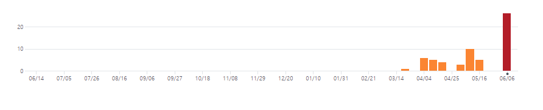

# KINGDOM RUSH 모작

**1. 게임 소개**
`KINGDOM RUSH`라는  타워 디펜스 게임 모작
	

**2. 현재까지의 진행 상황**

|개발 주제|상세 내용|개발 진척도|
|:---:|:---:|:---:|
|메뉴|메인 메뉴, 스테이지 선택|100%|
|적|플레이어 아군 공격, 특정 지점까지 이동|100%|
|타워|4가지 종류의 타워|75%|
|플레이어 컨트롤|타워 건설, 업그레이드|100%|
|맵|맵 표시, 이동|100%|

**3.  git commit 자료**

| 주 |  날짜 |커밋 횟수|
|:---:|:---:|:---:|
|1주차|04/05 ~ 04/11|5회|
|2주차|04/12 ~ 04/18|0회|
|3주차|04/19 ~ 04/25|4회|
|4주차|04/26 ~ 05/02|1회|
|5주차|05/03 ~ 05/11|2회|
|6주차|05/10 ~ 05/16|10회|
|7주차|05/17 ~ 05/23|5회|
|8주차|05/24 ~ 05/30|0회|
|9주차|05/31 ~ 06/06|0회|
|10주차|06/07 ~ 06/13|26회|

총 53회 커밋

**4. 구현된 내용 **
- 수업내용에서 차용한 것 :
	기본적인 프레임워크

- 참고한 것들 :
	stackoverflow에서 배경음악 재생을 위한 방법 참고

- 직접 개발한 것 :
	맵 4 방향 스크롤링
	타워 빌딩
	적 발견 및 추적 공격

**5. 아쉬운 내용**
- 하고 싶었지만 못 한 것들:
	 대포 타워가 포탄을 발사할 때 포물선 운동을 하는데 이를 구현하지 못하여 
 	세 종류의 타워만 구현하였다.
	 타워가 아닌 특수 능력 개발을 하지 못했다.
	 프로젝트에 시간을 할애하지 못하여 게임의 벨런스를 잡지 못했다.

- 팔기 위해 보충할 것들
	 다양한 종류의 적
	 UI 표시

- 기말 프로젝트를 하면서 겪은 어려움
	 viewport 변환을 통한 카메라 구현을 할 줄 몰라서 맵 비트맵 자체를 이동시켜서
	구현하는 바람에 그 맵 위에 있는 모든 오브젝트 또한 이동시켜야 되서 
	그것으로 인한 버그를 해결하는데 시간이 걸림