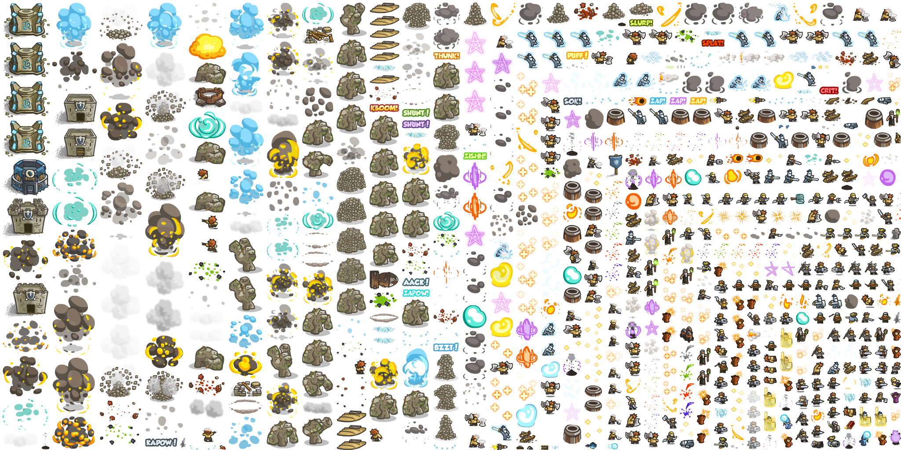

# KINGDOM RUSH 모작

**1. 게임 소개**
`KINGDOM RUSH`라는  타워 디펜스 게임 모작
	

**2. 현재까지의 진행 상황**
|개발 주제|상세 내용|개발 진척도|
|:---:|:---:|:---:|
|메뉴|메인 메뉴, 스테이지 선택|50%|
|적|플레이어 아군 공격, 특정 지점까지 이동|50%|
|타워|4가지 종류의 타워|75%|
|플레이어 컨트롤|타워 건설, 업그레이드|75%|
|맵|맵 표시, 이동|0%|

**3.  git commit 자료**

| 주 |  날짜 |커밋 횟수|
|:---:|:---:|:---:|
|1주차|04/05 ~ 04/11|5회|
|2주차|04/12 ~ 04/18|0회|
|3주차|04/19 ~ 04/25|4회|
|4주차|04/26 ~ 05/02|1회|
|5주차|05/03 ~ 05/11|2회|
|6주차|05/10 ~ 05/16|10회|
|7주차|05/17 ~ 05/23|2회|

**4. 게임내 오브젝트**
|이름|구성 정보|상호 작용|구분|
|:---:|:---:|:---:|:---:|
|MovingButtonObject|처음 시작할때 내려옴, 버튼과 동일한 역할|press down후 범위안에서 press up하면 메인 메뉴에 게임으로 스테이트 변경|메인 매뉴 구성 요소|
|AnimationGameBitmapVertical|수직으로 이루어진 애니메이션 스프라이트 렌더링용 비트맵 오브젝트||코드 상 구성 요소|
|EnemyGenerator||특정 시간이 지날때마다 Enemy 생성|게임 내 구성 요소|
|Enemy||지정된 점들 사이를 이동, Soldier가 범위안에 들어올 경우 Soldier가 방향으로 이동 후 공격 범위 안에 들어올 경우 공격, Soldier가 범위에서 없어질 경우 이동시 이전에 이동하던 지점으로 이동|게임 내 구성 요소|
|TowerBuilder|타워가 지어질 장소|플레이어의 터치 이벤트에 따라 UI를 보여주고 TowerObject 생성후 삭제됨|게임 내 구성 요소|
|TowerObject|각종 타워를 생성하기 위한 오브젝트(상속 전용)|타워의 애니메이션 여부에 따라 다른 비트맵 오브젝트 생성|코드 상 구성 요소|
|ArcherTower||Enemy가 가까이 올경우 적 방향으로 Arrow 생성|게임 내 구성 요소|
|MagicTower||Enemy가 가까이 올경우 적 방향으로 Arrow 생성|게임 내 구성 요소|
|BombTower||Enemy가 가까이 올경우 적 방향으로 Bomb 생성|게임 내 구성 요소|
|SoldierTower||Solider를 생성, 만약 3개의 자신의 생성한 Solider가 게임에 있을 경우 생성 중지|게임 내 구성 요소|
|Arrow||지정된 방향으로 날라가는 물체, Enemy와 충돌할 경우 Enemy의 hp를 감소시키고 삭제됨|게임 내 구성 요소|
|Bomb||지정된 방향으로 날라가는 물체, 화면 아래 방향으로 가속도를 받아 떨어짐|게임 내 구성 요소|
|Soldier||지정된 위치에서 가만히 있다가 Enemy가 범위안에 들어올 경우 Enemy 방향으로 이동 후 공격 범위 안에 들어올 경우 공격, Enemy가 범위에서 없어질 경우 이전에 지정된 장소로 이동|게임 내 구성 요소|

**5. 구현 애로사항**

- 앱 데이터 내에 게임에 사용되는 이미지가 있지만 
  한 개에 여러 오브젝트에 대한 이미지가 들어가 있어서 크기가 다 달라서
  특정 오브젝트에 관한 이미지를 얻기 위해서는 수동으로 좌표를 주어야 한다. 
- 게임 월드를 이동하기 위한 플레이어의 터치 방향으로 움직이며
  지정된 이미지의 특정 범위를 보여주는 것을 구현하는 데 실패했다.

