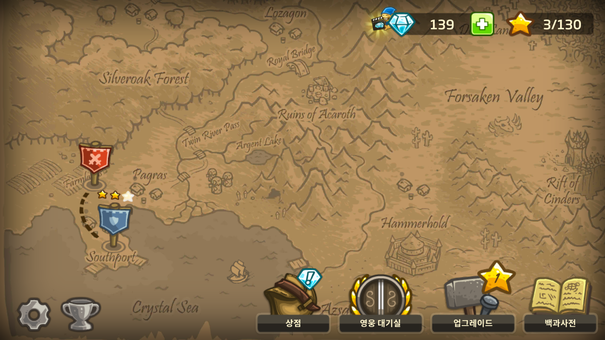

# KINGDOM RUSH 모작

**1. 게임 컨셉**
-  High Concept:  
	`Ironhide Game Studio`라는 회사에서 만든 `KINGDOM RUSH`라는  타워 디펜스 게임 모작

-  핵심 메카닉:
	- 일정한 길을 따라 이동하는 적이 길 끝까지 이동하는 것을 막기 위해 길 주변에 타워(공격 유닛)을 배치함
	- 적을 죽일때마다 일정 자원을 얻고 그 자원으로 타워를 업그레이드 하여 더 강력한 적을 막아내고 이를 반복하여 일정 적 무리의 이동을 막으면 게임에서 승리함
	

**2. 개발 범위**
- 개발 주요 요소:
	- 맵 확대 축소 및 이동
	- 일정 루트를 중심으로 적 캐릭터 이동
	- 캐릭터 프레임 애니메이션
	- 게임 진행 정보 표시
	- 캐릭터 선택

**3. 예상 게임 흐름**
1. 예상 게임 스테이트
	
	

	
	- 메인 메뉴 스테이트
	

	
	- 스테이지 선택 스테이트
	

	
	- 게임 플레이 스테이트

2. 게임 플레이

	- 자원(골드)를 소비하여 타워 건설

	- 적은 맵의 끝 부분 특정 위치에서 부터 길을 따라 이동

	- 길을 따라 이동하는 적을 타워로 자동 공격

	- 적이 길의 반대편 끝까지 이동할 경우 목숨이 줄어들고 0이 될 시 패배

	- 적을 죽여 모은 자원으로 다른 타워를 건설하거나 건설된 타워 업그레이드

	- 특수 능력으로 강력한 공격을 적에게 줄 수 있음

	- 모든 웨이브(적 무리의 이동) 동안 목숨이 0이 되지 않는다면 승리

**4. 개발 일정**
| 주 |  날짜 |개발 내용|
|:---:|:---:|:---:|
|1주차|04/05 ~ 04/11| 메인 메뉴 버튼 제작|
|2주차|04/12 ~ 04/18| 스테이지 선택 버튼 제작|
|3주차|04/19 ~ 04/25| 게임 플레이 맵 제작|
|4주차|04/26 ~ 05/02| 적 애니메이션 및 생성|
|5주차|05/03 ~ 05/11| 맵에서 타워 건설 위치 선택 및 건설 / 궁수 타워, 마법사 타워 제작|
|6주차|05/10 ~ 05/16| 병영 타워, 포병 타워 제작 / 적 공격 및 타워 업그레이드|
|7주차|05/17 ~ 05/23| 적 루트에 따라 이동, 자동 생성|
|8주차|05/24 ~ 05/30| 특수 공격 및 자원 수집, 웨이브 수 표시 UI|
|9주차|05/31 ~ 06/06| 게임 결과 표시 및 버그 수정|
